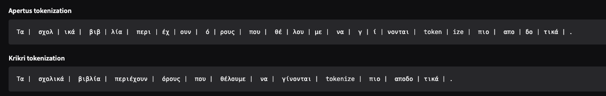

# glossApi-Tokenizer


[app screenshot](./assets/tokenizer_visualizer.png)

The aim of this project is to adapt the tokenizer of `swiss-ai/Apertus-8B-Instruct-2509` so it handles Greek more efficiently.

The current workflow is:

1. Extract the base Apertus tokenizer.
2. Compare its Greek segmentation against a Greek-oriented tokenizer such as `ilsp/Llama-Krikri-8B-Instruct`.
3. Use those comparisons to guide the next vocabulary-extension step.

## Clariden setup

The default `python3` on the Clariden login environment is too old for this workflow. In this workspace it is `Python 3.6.15`, so the examples below should be run through `uenv`.

Pull the recommended image once:

```bash
uenv image pull prgenv-gnu/24.11:v1
```

Create a local virtual environment and install the required packages:

```bash
uenv run prgenv-gnu/24.11:v1 --view=default -- bash -lc '
cd /users/p-skarvelis/glossApi-Tokenizer
python3 -m venv .venv-uenv
source .venv-uenv/bin/activate
pip install --upgrade pip
pip install -r requirements.txt
'
```

After that, run the scripts through the same `uenv` wrapper.

To avoid typing the full `uenv run ... bash -lc ...` command every time, this repo also includes [run_uenv.sh](run_uenv.sh):

```bash
./run_uenv.sh python --version
```

For the web visualizer, install `gradio` into the same environment once:

```bash
./run_uenv.sh python -m pip install -r requirements.txt
```

## Example usage

### 1. Extract the base Apertus tokenizer

This downloads the tokenizer, saves it under `artifacts/tokenizers/apertus-base`, writes a small metadata report to `artifacts/reports/tokenizer_baseline.json`, and also creates `artifacts/tokenizers/apertus-base/tokenizer_readable.json`, which keeps the same schema as `tokenizer.json` but replaces mojibake-like token strings with decoded text where that can be done safely.

```bash
./run_uenv.sh python scripts/extract_apertus_tokenizer.py --trust-remote-code
```

You can also override the output locations:

```bash
./run_uenv.sh python scripts/extract_apertus_tokenizer.py \
  --trust-remote-code \
  --output-dir artifacts/tokenizers/apertus-base \
  --report-path artifacts/reports/tokenizer_baseline.json
```

### 1b. Extract the Krikri reference tokenizer

This does the same for `ilsp/Llama-Krikri-8B-Instruct`, saving the tokenizer under `artifacts/tokenizers/krikri-base`, the metadata report under `artifacts/reports/tokenizer_krikri_baseline.json`, and a schema-preserving readable export under `artifacts/tokenizers/krikri-base/tokenizer_readable.json`.

```bash
./run_uenv.sh python scripts/extract_krikri_tokenizer.py --trust-remote-code
```

You can also override the output locations:

```bash
./run_uenv.sh python scripts/extract_krikri_tokenizer.py \
  --trust-remote-code \
  --output-dir artifacts/tokenizers/krikri-base \
  --report-path artifacts/reports/tokenizer_krikri_baseline.json
```

### 2. Compare Apertus against the Greek reference tokenizer

Pass Greek samples inline with repeated `--text` arguments:

```bash
./run_uenv.sh python scripts/compare_tokenizers.py \
  --trust-remote-code \
  --text "Η ελληνική γλώσσα χρειάζεται καλύτερη κάλυψη στο tokenizer." \
  --text "Τα σχολικά βιβλία περιέχουν όρους που θέλουμε να γίνονται tokenize πιο αποδοτικά."
```

Or read one sample per line from [greek_samples.txt](greek_samples.txt) and save a JSON report:

```bash
./run_uenv.sh python scripts/compare_tokenizers.py \
  --trust-remote-code \
  --sample-file greek_samples.txt \
  --report-path artifacts/reports/tokenizer_compare.json
```

### 3. Use a local tokenizer path instead of a Hub id

After extracting the base tokenizer, you can compare the saved local copy directly:

```bash
./run_uenv.sh python scripts/compare_tokenizers.py \
  --trust-remote-code \
  --base-tokenizer artifacts/tokenizers/apertus-base \
  --reference-tokenizer ilsp/Llama-Krikri-8B-Instruct \
  --sample-file greek_samples.txt
```

### 4. Diff the saved tokenizer vocabularies directly

After extracting both tokenizers, compare their vocabularies and save a JSON diff report:

```bash
./run_uenv.sh python scripts/diff_tokenizer_vocabs.py \
  --trust-remote-code \
  --base-tokenizer artifacts/tokenizers/apertus-base \
  --reference-tokenizer artifacts/tokenizers/krikri-base \
  --report-path artifacts/reports/tokenizer_vocab_diff.json
```

This reports the shared token count, the tokens unique to each tokenizer, and example raw and decoded entries for each set.

To focus only on tokens whose decoded text contains Greek characters, use the filter mode:

```bash
./run_uenv.sh python scripts/diff_tokenizer_vocabs.py \
  --trust-remote-code \
  --base-tokenizer artifacts/tokenizers/apertus-base \
  --reference-tokenizer artifacts/tokenizers/krikri-base \
  --filter-mode greek \
  --report-path artifacts/reports/tokenizer_vocab_diff_greek.json
```

### 5. Launch the visualizer

Start the local web UI on `http://localhost:7860/`:

```bash
./run_visualizer.sh
```
* you can stop the visualizer with `pkill -f "python visualizer/app.py"`

The UI sends each non-empty line of input text to `scripts/compare_tokenizers.py` and displays the summary, per-sample tokenization, and raw JSON report.

### 6. Count Greek words and rank tokenizer candidates

After extracting tokenizers, you can mine frequent Greek words from FineWeb2-HQ and turn them into a ranked candidate token list.

First, run the unified counter on the Greek `ell_Grek` split. The same script can export regular word counts plus quoted and capitalized static candidate lists in one pass:

```bash
./run_uenv.sh python vocabularyGen/countWords.py \
  --count-modes words quoted capitalized \
  --min-count 5 \
  --report-every 10000 \
  --overwrite
```

That writes the regular word-count artifacts plus, when the corresponding count modes are enabled, the generated text exports `artifacts/vocab_candidates/fineweb2_hq_ell_grek_quoted_words.txt` and `artifacts/vocab_candidates/fineweb2_hq_ell_grek_capitalized_words.txt` together with their SQLite sidecars.
Capitalized mode preserves observed uppercase-initial forms so sentence-initial variants and proper-name-like words still influence the merged selector ranking through the capitalized SQLite source. If you later want an exact unspaced surface form, copy only the entries you actually want into a curated file under `vocabularyGen/static/`.

Then rank candidate tokens against the saved Apertus tokenizer:

```bash
./run_uenv.sh python vocabularyGen/selectTokenizerCandidates.py \
  --min-count 5 \
  --min-base-token-count 4 \
  --min-base-token-count-high-frequency 5 \
  --max-selected 5000 \
  --overwrite
```

This produces:

- `artifacts/vocab_candidates/fineweb2_hq_ell_grek_candidates.tsv`
- `artifacts/vocab_candidates/selected_tokens_v1.txt`
- `artifacts/reports/fineweb2_hq_ell_grek_candidate_selection.json`

The selector uses only the base Apertus tokenizer. By default it combines the regular word-count database with the quoted-word and capitalized-word SQLite outputs when they exist, ranks that merged catalog by frequency and base-tokenizer fragmentation, collapses case variants so lowercase forms are preferred over duplicate capitalized forms, and then appends cleaned curated static candidates from `vocabularyGen/static/`.

### 7. Build the extended Apertus tokenizer

After reviewing `artifacts/vocab_candidates/selected_tokens_v1.txt`, create the extended tokenizer directory:

```bash
./run_uenv.sh python scripts/extend_apertus_tokenizer.py \
  --overwrite
```

This writes:

- `artifacts/tokenizers/apertus-greek-v1`
- `artifacts/tokenizers/apertus-greek-v1/tokenizer_readable.json`
- `artifacts/reports/tokenizer_apertus_greek_v1.json`

The script reads the selected token list, skips entries that already exist in the base tokenizer as exact single tokens, adds the rest in file order, saves the new tokenizer, and writes a report with added/skipped counts and sample tokens.

## Notes

- `--trust-remote-code` is included because some model repositories require it when loading tokenizers.
- The extraction example was run successfully through `uenv` and produced `artifacts/tokenizers/apertus-base`, `artifacts/reports/tokenizer_baseline.json`, and `artifacts/tokenizers/apertus-base/tokenizer_readable.json`.
- A matching extractor is also available for `ilsp/Llama-Krikri-8B-Instruct` via `scripts/extract_krikri_tokenizer.py`, with outputs under `artifacts/tokenizers/krikri-base` and `artifacts/reports/tokenizer_krikri_baseline.json`.
- The extractor logic for Apertus and Krikri is shared through `scripts/tokenizer_extract_common.py`, so both scripts stay behaviorally aligned.
- `tokenizer_readable.json` keeps the same top-level structure as `tokenizer.json`. It replaces raw byte-level token strings with decoded text where the decoded form is unique, and falls back to the original raw token string when multiple internal tokens would collapse to the same decoded text.
- The inline comparison example was also run successfully through `uenv`. On the two Greek samples in this repo, the Greek reference tokenizer used 23 tokens versus 44 for the base Apertus tokenizer, a reduction of about 47.73%.
- The comparison script prints per-sample tokenization details and an aggregate summary.
- `scripts/diff_tokenizer_vocabs.py` compares two tokenizer vocabularies directly and writes a JSON report with overlap counts plus example raw and decoded token entries.
- `scripts/diff_tokenizer_vocabs.py` also supports `--filter-mode greek` to restrict the diff to tokens whose decoded content contains Greek characters.
- `visualizer/app.py` provides a local Gradio UI on `http://localhost:7860/` and shells out to `scripts/compare_tokenizers.py` for the actual comparison.
- Many modern tokenizers use an internal byte-level representation, so raw vocabulary entries can look like mojibake such as `ÏĦικά`. The comparison script prints decoded token pieces for readability, and `tokenizer_readable.json` applies the same idea to the saved tokenizer export where it is safe to do so.
- Hugging Face downloads worked without authentication here, but the CLI warns that setting `HF_TOKEN` is recommended for better rate limits.
- `vocabularyGen/countWords.py` is the unified FineWeb2-HQ Greek preprocessor: it streams through `uenv`, keeps exact counts in SQLite during the run, exports the JSON frequency list, and can optionally emit quoted and capitalized static candidate lists in the same pass.
- `vocabularyGen/selectTokenizerCandidates.py` turns those counts into a ranked token candidate list using only the base tokenizer, with a more conservative aligned-init recipe that now defaults to a minimum base token count of 4.
- `scripts/extend_apertus_tokenizer.py` consumes `artifacts/vocab_candidates/selected_tokens_v1.txt` and writes the extended tokenizer under `artifacts/tokenizers/apertus-greek-v1`. When `--base-model` is used, it mean-initializes the new input embeddings from the original subtoken decomposition and, by default, zero-initializes untied output-head rows to reduce aligned-init regression. Use `--untied-output-init-strategy mean` only if you explicitly want the older untied-head behavior.
- The CPT launchers now accept `SAVE_TOTAL_LIMIT=all` to keep every intermediate checkpoint under `OUTPUT_DIR/warmup/` and `OUTPUT_DIR/full/`. If unset, they keep the existing default of `3` retained checkpoints per phase, while `OUTPUT_DIR/final/` is still exported separately at the end of a non-benchmark run.